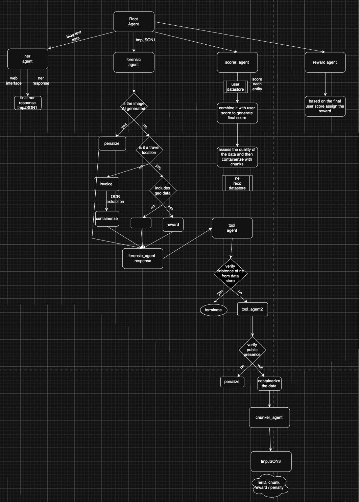

# PDF Conversion Guide for Travel Blog HLD

This guide provides multiple methods to convert the `travel_blog_hld.md` Markdown document to PDF format.

---

## Method 1: Using Pandoc (Recommended)

Pandoc is a universal document converter that produces high-quality PDFs.

### Installation

#### macOS
```bash
brew install pandoc
brew install basictex  # For LaTeX support
```

#### Ubuntu/Debian
```bash
sudo apt-get update
sudo apt-get install pandoc texlive-latex-base texlive-fonts-recommended
```

#### Windows
Download and install from: https://pandoc.org/installing.html

### Basic Conversion

```bash
cd /Users/int1951/Desktop/dataEnrichment/data/HLD

# Simple conversion
pandoc travel_blog_hld.md -o travel_blog_hld.pdf

# With custom styling
pandoc travel_blog_hld.md -o travel_blog_hld.pdf \
  --pdf-engine=xelatex \
  --toc \
  --toc-depth=3 \
  -V geometry:margin=1in \
  -V fontsize=11pt \
  -V documentclass=report
```

### Advanced Conversion with Custom Template

```bash
pandoc travel_blog_hld.md -o travel_blog_hld.pdf \
  --pdf-engine=xelatex \
  --toc \
  --toc-depth=3 \
  --number-sections \
  -V geometry:margin=1in \
  -V fontsize=11pt \
  -V documentclass=report \
  -V colorlinks=true \
  -V linkcolor=blue \
  -V urlcolor=blue \
  -V toccolor=black \
  --highlight-style=tango
```

**Note**: Mermaid diagrams will not render with Pandoc. See Method 4 for Mermaid support.

---

## Method 2: Using Markdown to PDF VSCode Extension

If you're using Visual Code or Cursor:

1. Install the "Markdown PDF" extension
   - Extension ID: `yzane.markdown-pdf`

2. Open `travel_blog_hld.md` in the editor

3. Press `Ctrl+Shift+P` (or `Cmd+Shift+P` on Mac)

4. Type "Markdown PDF: Export (pdf)" and press Enter

5. The PDF will be generated in the same directory

### Configuration (Optional)

Add to your `.vscode/settings.json`:

```json
{
  "markdown-pdf.executablePath": "",
  "markdown-pdf.format": "A4",
  "markdown-pdf.displayHeaderFooter": true,
  "markdown-pdf.headerTemplate": "<div style='font-size: 9px; margin-left: 1cm;'><span class='title'></span></div>",
  "markdown-pdf.footerTemplate": "<div style='font-size: 9px; margin: 0 auto;'><span class='pageNumber'></span> / <span class='totalPages'></span></div>",
  "markdown-pdf.margin": {
    "top": "1.5cm",
    "bottom": "1.5cm",
    "right": "1.5cm",
    "left": "1.5cm"
  }
}
```

---

## Method 3: Using Online Converters

Several online tools can convert Markdown to PDF:

### Option A: Dillinger (https://dillinger.io/)
1. Visit https://dillinger.io/
2. Copy the content of `travel_blog_hld.md`
3. Paste into the editor
4. Click "Export As" → "PDF"

### Option B: Markdown to PDF (https://www.markdowntopdf.com/)
1. Visit https://www.markdowntopdf.com/
2. Upload `travel_blog_hld.md`
3. Click "Convert"
4. Download the generated PDF

### Option C: CloudConvert (https://cloudconvert.com/)
1. Visit https://cloudconvert.com/md-to-pdf
2. Upload `travel_blog_hld.md`
3. Click "Start Conversion"
4. Download the PDF

**Note**: Online converters may have limitations with Mermaid diagrams.

---

## Method 4: With Mermaid Diagram Support

Since the HLD contains Mermaid diagrams, you'll need a tool that supports rendering them.

### Using md-to-pdf (Node.js Package)

```bash
# Install globally
npm install -g md-to-pdf

# Convert with Mermaid support
md-to-pdf travel_blog_hld.md \
  --config-file md-to-pdf-config.json
```

Create `md-to-pdf-config.json`:
```json
{
  "pdf_options": {
    "format": "A4",
    "margin": "20mm",
    "printBackground": true
  },
  "stylesheet": ["https://unpkg.com/github-markdown-css"],
  "body_class": ["markdown-body"],
  "marked_options": {
    "mermaid": true
  }
}
```

### Using Mermaid CLI + Pandoc

```bash
# Install mermaid-cli
npm install -g @mermaid-js/mermaid-cli

# This is a two-step process:
# 1. Pre-process to convert mermaid to images
# 2. Convert to PDF

# Create a script to handle this
# (You'll need to manually extract mermaid blocks or use a preprocessor)
```

---

## Method 5: Using Grip + Print to PDF

Grip renders GitHub-flavored Markdown in a browser:

```bash
# Install Grip
pip install grip

# Serve the markdown file
cd /Users/int1951/Desktop/dataEnrichment/data/HLD
grip travel_blog_hld.md

# Open http://localhost:6419 in your browser
# Use browser's "Print to PDF" function (Cmd+P or Ctrl+P)
# Select "Save as PDF"
```

**Note**: This method preserves GitHub-style rendering but not Mermaid diagrams.

---

## Method 6: Using Typora (Commercial Software)

Typora is a Markdown editor with excellent export capabilities:

1. Download Typora from https://typora.io/
2. Open `travel_blog_hld.md` in Typora
3. Go to File → Export → PDF
4. Choose export options and save

**Features**:
- Native Mermaid support
- Beautiful formatting
- Page breaks control
- Custom themes

**Note**: Typora requires a license ($14.99 one-time purchase).

---

## Method 7: Using Docusaurus or MkDocs

For a more professional documentation site that can export to PDF:

### Using MkDocs with PDF Export

```bash
# Install MkDocs and pdf plugin
pip install mkdocs mkdocs-material mkdocs-with-pdf

# Create mkdocs.yml configuration
# Add your markdown files
# Build and export
mkdocs build
```

This creates a complete documentation website that can be printed to PDF.

---

## Recommended Approach

For this HLD document, we recommend:

### For Quick Preview (Without Mermaid)
```bash
pandoc travel_blog_hld.md -o travel_blog_hld.pdf \
  --pdf-engine=xelatex \
  --toc \
  -V geometry:margin=1in
```

### For Professional Output (With Mermaid)
Use **Typora** or **md-to-pdf** with Mermaid support

### For Online Sharing
1. Host the Markdown on GitHub
2. Use GitHub Pages with a documentation framework
3. Provide both Markdown and PDF versions

---

## Embedding the Diagram Image

The HLD references `diagram.png`. To ensure it appears in the PDF:

1. **Verify the relative path** in the markdown:
   ```markdown
   
   ```

2. **For Pandoc**, the image should be in the same directory or use an absolute path:
   ```markdown
   
   ```

3. **The current reference** in section 7 uses a relative path, which should work when converting from the HLD directory.

---

## Post-Conversion Checklist

After converting to PDF, verify:

- ✅ Table of contents is generated correctly
- ✅ All sections are numbered properly
- ✅ Code blocks are formatted with syntax highlighting
- ✅ Tables are properly aligned
- ✅ `diagram.png` is embedded and visible
- ✅ Mermaid diagrams are rendered (if using a compatible tool)
- ✅ Links are clickable (for digital distribution)
- ✅ Page breaks are logical and don't split tables/diagrams
- ✅ Headers and footers are appropriate
- ✅ Document metadata (title, author, date) is set

---

## Troubleshooting

### Issue: Pandoc fails with LaTeX errors
**Solution**: Install a complete TeX distribution:
```bash
# macOS
brew install --cask mactex

# Ubuntu
sudo apt-get install texlive-full
```

### Issue: Images not showing in PDF
**Solution**: Use absolute paths or ensure images are in the correct relative location

### Issue: Mermaid diagrams not rendering
**Solution**: Use md-to-pdf or Typora, or pre-convert Mermaid to PNG images

### Issue: Code blocks not syntax highlighted
**Solution**: Add `--highlight-style=tango` to Pandoc command

### Issue: Table of contents not generated
**Solution**: Add `--toc` flag to Pandoc command

---

## Automation Script

Save this as `convert_hld_to_pdf.sh`:

```bash
#!/bin/bash

# Navigate to HLD directory
cd "$(dirname "$0")"

# Check if pandoc is installed
if ! command -v pandoc &> /dev/null; then
    echo "Pandoc is not installed. Install it with: brew install pandoc"
    exit 1
fi

# Convert to PDF
echo "Converting travel_blog_hld.md to PDF..."

pandoc travel_blog_hld.md -o travel_blog_hld.pdf \
  --pdf-engine=xelatex \
  --toc \
  --toc-depth=3 \
  --number-sections \
  -V geometry:margin=1in \
  -V fontsize=11pt \
  -V documentclass=report \
  -V colorlinks=true \
  -V linkcolor=blue \
  -V urlcolor=blue \
  -V toccolor=black \
  -V title="Travel Blog Platform - High Level Design" \
  -V author="System Architecture Team" \
  -V date="January 15, 2026" \
  --highlight-style=tango

if [ $? -eq 0 ]; then
    echo "✅ PDF generated successfully: travel_blog_hld.pdf"
    open travel_blog_hld.pdf  # macOS
    # xdg-open travel_blog_hld.pdf  # Linux
else
    echo "❌ PDF generation failed"
    exit 1
fi
```

Make it executable:
```bash
chmod +x convert_hld_to_pdf.sh
./convert_hld_to_pdf.sh
```

---

## Additional Resources

- Pandoc Documentation: https://pandoc.org/MANUAL.html
- Mermaid Documentation: https://mermaid-js.github.io/
- Markdown Guide: https://www.markdownguide.org/
- GitHub Flavored Markdown Spec: https://github.github.com/gfm/

---

**Last Updated**: January 15, 2026
